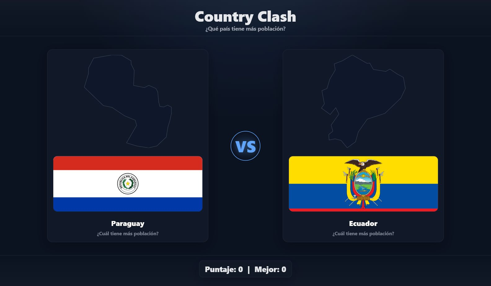

# Country Clash

**Country Clash** is a web game built with **React + Vite** where you choose which country has the larger population.

Each correct answer adds one point and keeps the winning country for the next round. The run continues until you miss.

## Demo

[Play on GitHub Pages](https://juanbeltranv.github.io/country-clash/)

## Preview

<p align="center">
  <a href="https://juanbeltranv.github.io/country-clash/" target="_blank">
    
  </a>
</p>

## Features

- Real country silhouettes using `world-atlas`, `topojson-client`, and `d3-geo`.
- Country flag, name, and population comparison.
- Current score and best score for the session.
- Loss modal with a quick restart action.
- Bundled fallback country data so GitHub Pages keeps working if the public API changes.
- Responsive dark interface for desktop and mobile screens.

## Tech Stack

- [React](https://react.dev/)
- [Vite](https://vitejs.dev/)
- [D3 Geo](https://github.com/d3/d3-geo)
- [TopoJSON Client](https://github.com/topojson/topojson-client)
- [world-atlas](https://github.com/topojson/world-atlas)
- [GitHub Pages](https://pages.github.com/)

## Local Development

```bash
git clone https://github.com/JuanBeltranV/country-clash.git
cd country-clash
npm install
npm run dev
```

Then open:

```text
http://localhost:5173
```
